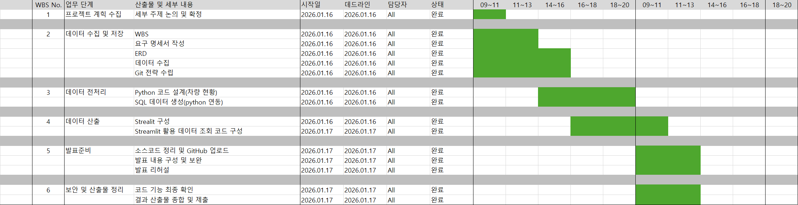
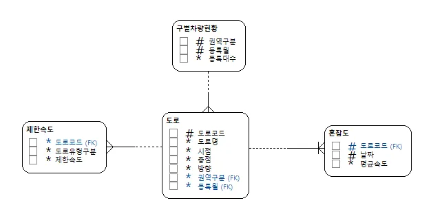

# 📊 Seoul Way

**서울시 도로(링크) 단위 평균속도(혼잡도)와  
자치구 차량 등록 현황을 DB로 통합하고,  
교통/혼잡 FAQ를 크롤링하여 제공하는 데이터 기반 서비스**

---

## 📅 프로젝트 기간
- 2026.01.16(금) ~ 2026.01.19(월)
- 총 2일

---

## 1. 팀 소개

### 1-1. 팀명
(추후 기재)

### 1-2. 팀원 구성 및 GitHub

| 이름 | 역할 | GitHub |
|----|----|----|
| 김규호 |  | 링크 |
| 김지원 |  | 링크 |
| 류지우 |  | 링크 |
| 박수영 |  | 링크 |

---

## 2. 프로젝트 개요

### 2-1. 프로젝트 명
**Seoul Way**

### 2-2. 프로젝트 소개
본 프로젝트는 서울시 교통 혼잡도(평균속도) 데이터를  
도로(링크) 단위로 저장하고,  
자치구 단위 차량 등록 현황과 함께 관리할 수 있도록  
MySQL 기반 DB(`traffic`)를 구축한 프로젝트이다.

또한 서울시설공단 FAQ 중 교통/혼잡 관련 문항(총 27건)을  
크롤링하여 DB에 적재함으로써  
사용자 정보 탐색 기능을 보완하였다.

---

## 3.기술 스택
-Python (requests, BeautifulSoup, mysql-connector)
-MySQL
-Streamlit
-Figma

---

## 4. WBS

프로젝트 전체 일정 및 작업 단계를 WBS 기반으로 관리하였다.

---

## 5. 요구사항 명세서

| ID | 요구사항 | 구현 여부 | 비고 |
|----|----|----|----|
| R1 | 교통 DB 생성 및 테이블 구축 | 완료 | DB 생성 및 스키마 확정 |
| R2 | 도로 정보 저장 (`tbl_road`) | 완료 | PK 설계 |
| R3 | 제한속도 저장 | 완료 | FK 연결 |
| R4 | 혼잡도 저장 | 완료 | 평균속도 컬럼 |
| R5 | 차량 등록 현황 | 완료 | 복합 PK |
| R6 | FAQ 크롤링 | 완료 | 총 27건 |

---
## 6. ERD
### 6-1. DA 모델(ERD)

본 프로젝트의 ERD는 도로(링크) 엔터티를 중심으로
제한속도 / 혼잡도 데이터가 연결되며,
자치구(권역구분) 기반 차량 등록 현황과
FAQ 테이블을 별도로 구성하였다.

1️⃣ 도로(tbl_road): road_id(PK), registered_region, 도로명/시점/종점/방향

2️⃣ 제한속도(tbl_speed_limit): road_code(FK → tbl_road.road_id), 제한속도

3️⃣ 혼잡도(tbl_congestion): road_code(FK), date_id, average_speed
-PK: (road_code, date_id)

4️⃣ 구별차량현황(tbl_registered_car):
-PK: (registered_region, registered_month)

5️⃣ FAQ(tbl_faq): faq_id(PK), faq_title, faq_contents, faq_section

---

## 7. 수행결과 (시연 페이지)
### 7-1. FAQ 크롤링 및 DB 적재 결과

-크롤링 대상: 서울시설공단 교통 FAQ
-크롤링 키워드: 혼잡 / 교통
-최종 적재 개수: 총 27개
-적재 테이블: tbl_faq

---

## 8. 한 줄 회고

- 김규호:
- 김지원:
- 류지우:
- 박수영:
